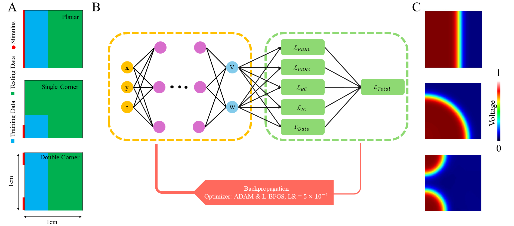

### openCARP-PINNs: Towards Faster Prediction of Cardiac Signals Propagation

> Alexander Zolotarev, Lucas Ip, Krishna Saveri, Balvinder Dhillon, Clara Martin, Caroline Roney <br />

The paper was submitted to STACOM workshop 2025. 

  ### Abstract

Investigation and prediction of cardiac electrophysiological (EP) properties are beneficial in developing personalised diagnostics and treatments for cardiac arrhythmias. 
Physics-Informed Neural Networks (PINNs) combine data-driven learning with underlying physical laws.
In cardiac electrophysiology, PINNs have been used in conjunction with biophysical models to predict electrical propagation faster than conventional biophysical modelling. 
Here, we proposed a novel toolbox with PINNs using the Mitchell-Schaeffer and Aliev-Panfilov ionic models to show fast and precise prediction of electrical wavefront propagation through in-silico heart tissue. 
For the generation of training data, we utilised OpenCARP, an open-source cardiac electrophysiology simulator. 
We conducted the experiments on a 2D in-silico grid with 3 different scenarios of wavefront initiation (a centrifugal wave from single or double corners of a 2D grid and a planar wave) - Figure.
We showed that openCARP-PINNs can accurately (with a mean RMSE below 0.2 in all experiments) and quickly (execution time of 16 ms) predict the shape of the action potential for both ionic models.
Moreover, openCARP-PINNs precisely define the wavefront of signal propagation (mean Dice score between masks of ground truth and predicted transmembrane potential for the nodes in the testing set is more than 0.9).
The proposed framework has the potential to guide treatment based on faster digital twins of patient hearts.



## Running code 


```

python main.py config.yaml name_of_experiment
```
